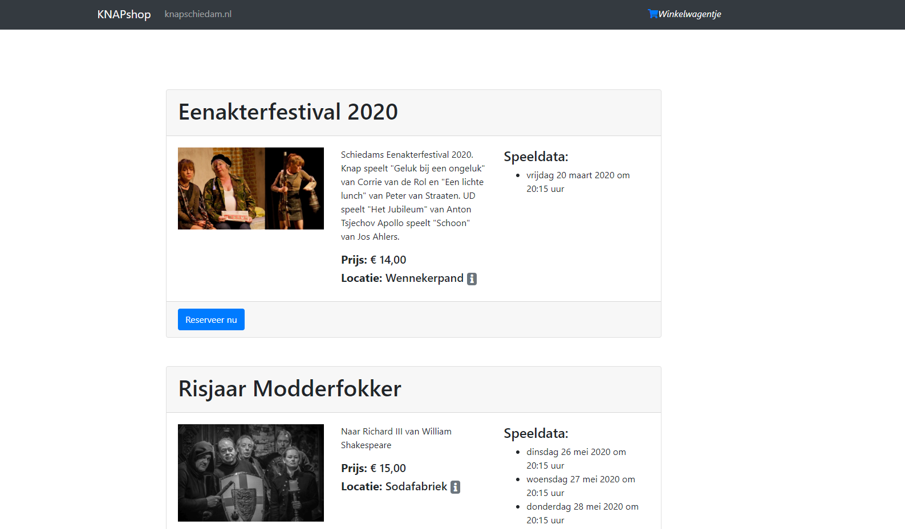

Voor amateur gezelschap [KNAP Schiedam](http://knapschiedam.nl/), waar ik zelf ook meespel, heb ik een eigen kaartverkoop systeem gebouwd. het begon in 2018 met de voorstelling Koning Lier, in het Stedelijk museum Schiedam. Het begon met een simpel formulier, waar bezoekers konden reserveren en is nu uitgegroeid tot echte webshop met automatsche betalingen via [Mollie](https://www.mollie.com/nl/).

Het is leuk om te zien hoe dit project zich in anderhalf jaar tijd heeft ontwikkeld, er staan nog een hoop features op de lijst dus ik blijf door ontwikkelen aan de deze ticketshop. 

## Neem een kijkje en bestel een kaartje in de shop ;)

[De KNAPshop](http://knapschiedam.nl/shop)

### Live voorbeeld
<iframe src="http://knapschiedam.nl/shop"></iframe>