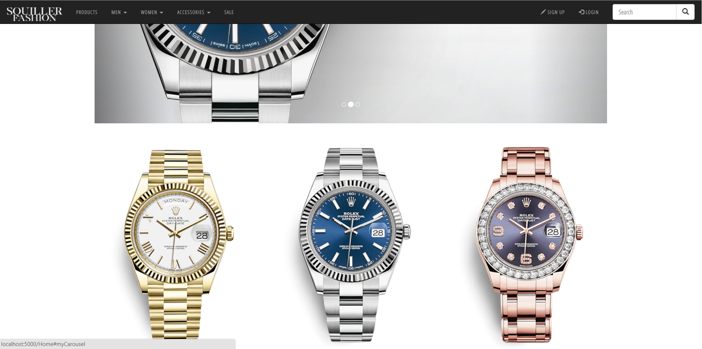

Het eerste project van mijn 2de jaar was het maken van een webshop, met onderwerp naar keuze. 
Wij hadden gekozen voor *High end fashion* webwinkel, met kleding van allemaal dure merken. 

Door de namen van alle teamleden te mengen kwamen we uit op: 

## Squiller Fashion!

<iframe width="424" height="238" src="https://www.youtube.com/embed/nf2ex320JJs" frameborder="0" allow="accelerometer; autoplay; encrypted-media; gyroscope; picture-in-picture" allowfullscreen></iframe>

Bij het bouwen van een webshop komt een hoop kijken, dus voor je begint kun je je afvragen: 
- Wie zijn je klanten?
- Wat wil je van je klanten weten?
- Wat voor producten verkoop je?
- Hoe zit het met voorraad beheer? 
- Wat voor betaalopties bied je aan?

## Tech

De webshop is geschreven in C#/.NET met behulp van entity framework core, voor het regelen van al het data verkeer. Als template engine hebben we gebruik gemaakt van Razor. 

Verder is nog een interassante de Paypal API, omdat dit een gratis betaaldienst is. 