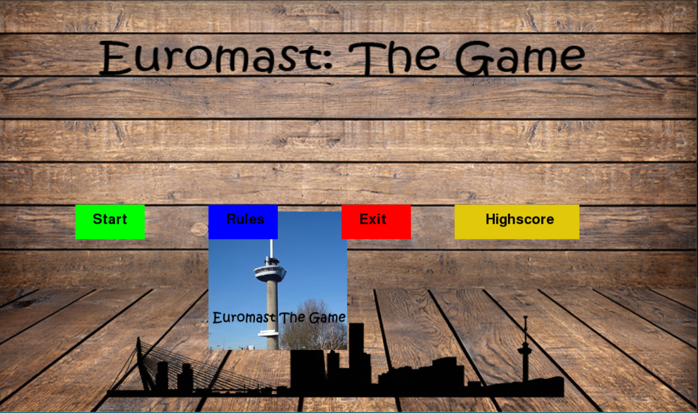

Het tweede project wat ik voor mijn opleiding heb gemaakt was een game, gemaakt met Pygame. Pygame is een opensource game engine gemaakt in Python.

[Bron code](https://github.com/Steven24K/Project-2-Game)

De game was origineel gebouwd voor Python 3.6, later heb ik een versie gemaakt die compatable is met Python 3.6. De dependency met de PostgreSQL database is komen te vervallen.

# Euromast The Game
Doel spel: Zoveel mogelijk vragen over Rotterdam correct beantwoorden en als eerste de top van de Euromast bereiken. 

<iframe width="900" height="506" src="https://www.youtube.com/embed/NOCupqNu5Ts" frameborder="0" allow="accelerometer; autoplay; encrypted-media; gyroscope; picture-in-picture" allowfullscreen></iframe>