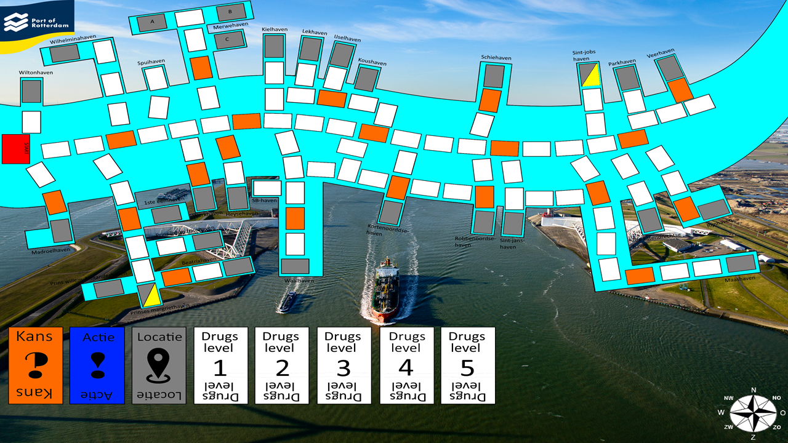

Het eerste project wat ik voor mijn opleiding heb gedaan was het maken van een borspel, het doel van dit project was om kennis te maken met de Scrum/Agile methodiek.

Het onderwerp voor ons spel is geworden: De haven van Rotterdam

## Bordspel: Smugglers of Rotterdam
Doel spel: Het smokkelen van zoveel mogelijk drugs in de haven van Rotterdam.

<iframe width="900" height="506" src="https://www.youtube.com/embed/xsx6hSirarM" frameborder="0" allow="accelerometer; autoplay; encrypted-media; gyroscope; picture-in-picture" allowfullscreen></iframe>