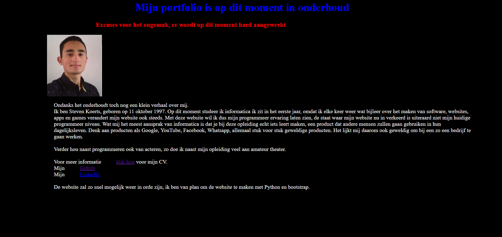

# Mijn portfolio's door de jaren heen

Hoewel ik nog niet zo lang geleden aan mijn opleiding informatica begon zijn mijn portfolio websites wel flink wat veranderd, qua design en qua intenties die ik met website wou bereiken. Hier laat ik in chronologische volgorde zien hoe mijn portfolio zich in de loop van mijn studie heeft ontwikkeld. Je kunt ook de verschillende designs terug zien op [The Way-Back-Machine](https://web.archive.org/web/20180701000000*/stevenkoerts.nl) van [web.archive.org](https://web.archive.org/). Een website die van heel veel websites een screenshot heeft van verschillende jaren, leuk voor als je bijvoorbeeld wilt weten hoe YouTube eruit zag op 23 april 2005. 

### Mijn portfolio in 2016
Uitsluitend primaire kleuren, niet schaalbaar, niet responsive. Het bevat overigens de minimale informatie die een werkgever nodig heeft en wat nodige extra's. 

En een mooie error pagina kan ook niet ontbreken.

### In 2017 heb ik al wat meer geleerd over webdevelopment

Hoewel is mijn website wel even in onderhoud geweest.

Ik besloot om een website te bouwen met Python en Django, de hosting werd wel wat duurder voor Python website. Dus heb ik Django gebruikt als een statische website builder.

Ik had in iedergeval een dynamische manier om projecten toe te voegen, vandaar die **Next-**button.

Op dit moment had ik ook Bootstrap ontdenkt.

### In 2018 ging ik volledig over op een statische website

Docusaurus is ook geschikt als portfolio, niet alleen voor Facebooks open source documentatie. 

### Mijn site anno nu

Bleek een volledige React based static site generator de ideale oplossing, ik ben benieuwd hoe mijn website zich verder ontwikkeld. 

En hiervoor gewoon een `iframe`, voor altijd de laatste versie.
<iframe src="http://stevenkoerts.nl"></iframe>

*#MadeWithGatsby*