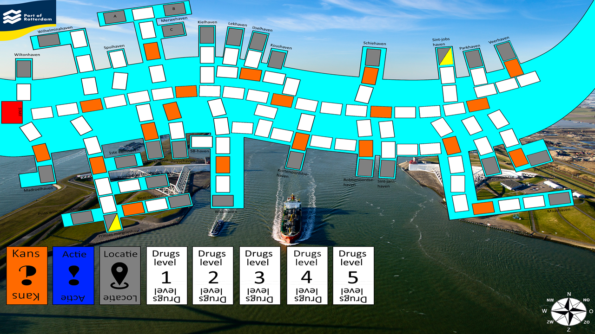

Dit was het eerste project wat ik heb gedaan voor mijn opleiding informatica. De bedoeling was om een bordspel te maken, dat over Rotterdam gaat. We konden kiezen uit de volgende thema's: Stad, haven of gezondheid. Wij hadden gekozen voor de Rotterdamse haven! Het doel van het spel is om drugs de haven van Rotterdam in te smokkelen, zonder gepakt te worden door de douane. Het diepere doel van het project was niet om een bordspel te maken, maar om kennis te maken met de project methodiek: Scrum. Aangezien dit het eerste project was, leek een bordspel hiervoor het meest geschikt, vanaf hier heb ik al mijn projecten via Scrum gedaan.

## Video
 

<iframe width="1048" height="590" src="https://www.youtube.com/embed/xsx6hSirarM" frameborder="0" allow="autoplay; encrypted-media" allowfullscreen></iframe>