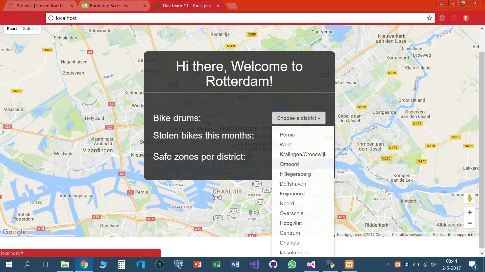
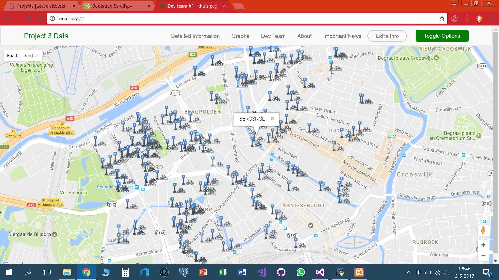
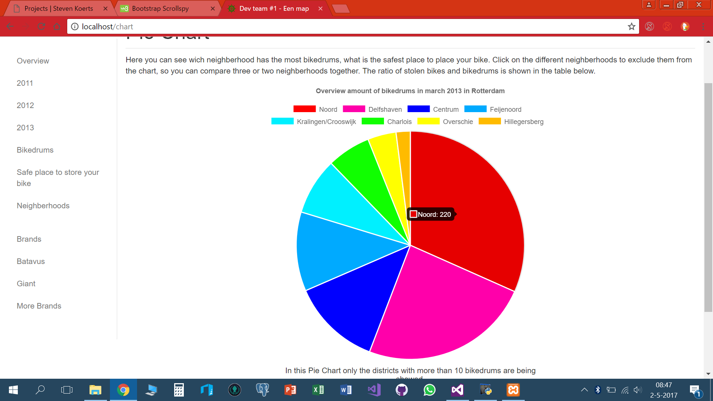
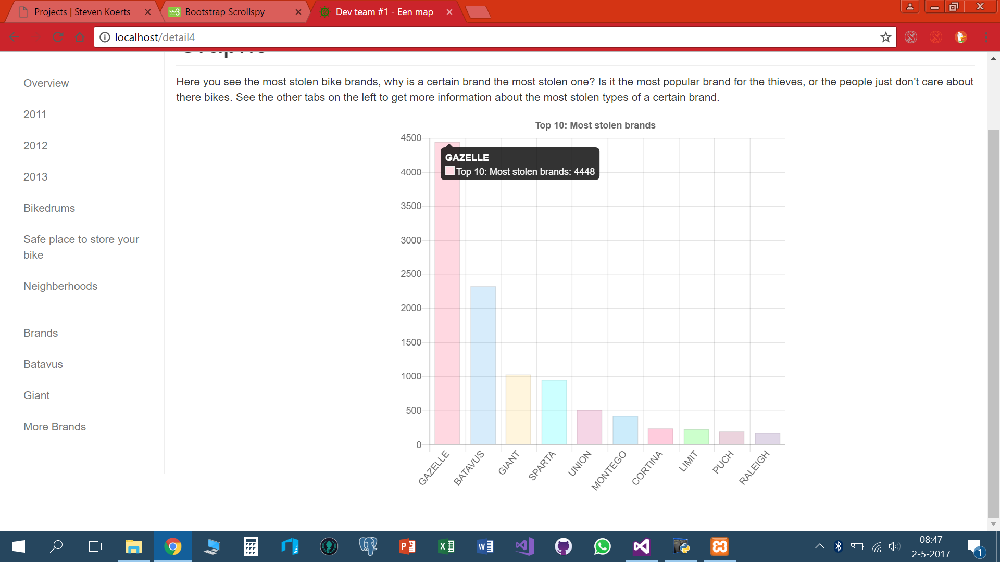

Het derde project wat ik voor mijn opleiding gedaan heb is het data project. In dit project moesten we een applicatie maken, die gebruik maakte van open data. De data haalde we van de website van Rotterdam Open Data. Hier vonden we een data set van alle gestolen fietsen in Rotterdam tussen 2011 en 2013 en locaties van fietsenstallingen in de regio. Toen deze data eenmaal in een database was verwerkt gingen aan de slag met de applicatie, een webapplicatie in dit geval. Als database management systeem hadden we PostgreSql gebruikt en we programmeerde in PHP. Op de website kun je allerlei grafieken zien waar van het aantal gestolen fietsen. Grafieken als gestolen fietsen door de jaren heen, gestolen fietsen per regio, gestolen fietsen per merk etc. Verder kon je nog zien welke regio de meeste fietsenstallingen had en zo konden we de conclusie trekken welke wijk in Rotterdam het veiligst is. De fietsen hadden we op de kaart gezet met behulp van de Google maps API.

## De datasets die we hebben gebruikt zijn te vinden op:

[rotterdamopendata.nl/](http://rotterdamopendata.nl/)

We hebben de volgende datasets gebruikt:
1. [Gestolen fietsen 2011 tot 2013](http://rotterdamopendata.nl/dataset/fietsdiefstal-rotterdam-2011-tot-2013)
2. [Fietstrommels Rotterdam](http://rotterdamopendata.nl/dataset/fietstrommels)

