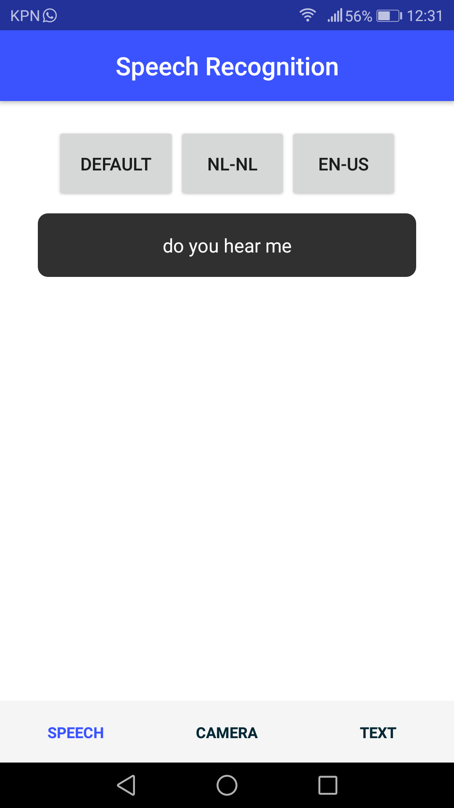
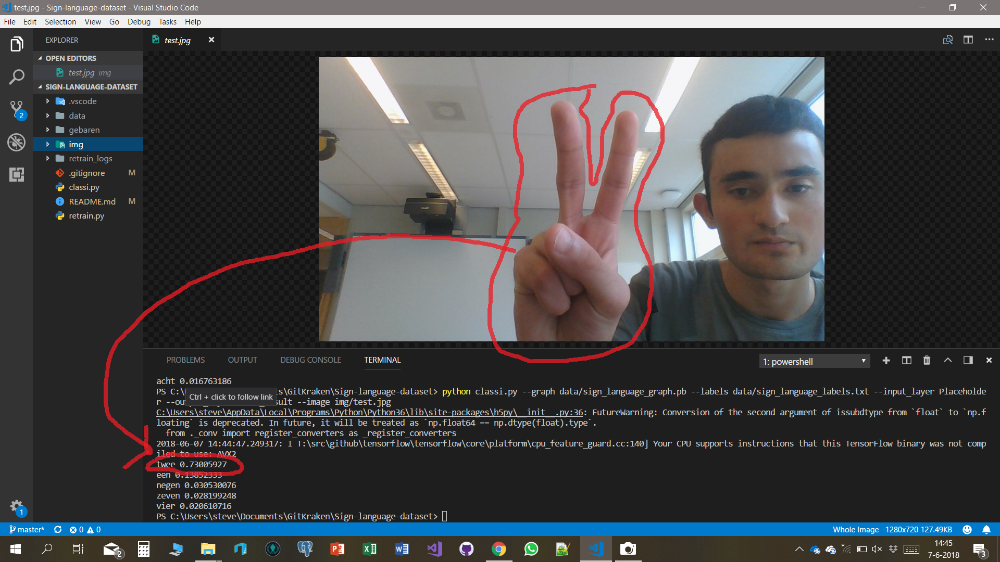
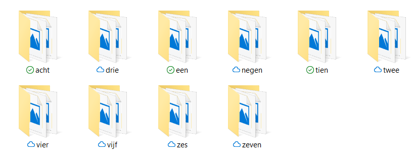
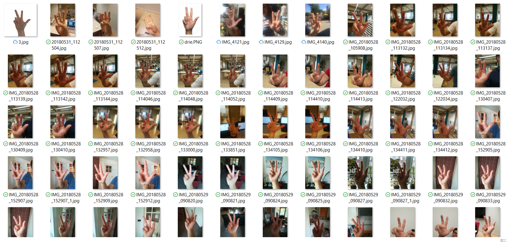

### Emerging Technologies

Dit is het laatste project dat ik heb gedaan voor mijn opleiding informatica. Dit project was erg bijzonder om te mogen doen, want we deden dit project voor twee opdrachtgevers. Een was de hogeschool van Rotterdam zelf onder de naam van *Emerging technologies*. 

De andere opdrachtgever was het bedrijf Sogeti, onder de naam van Project B. 

## Over Sogeti
[Sogeti](https://www.sogeti.nl/over-sogeti) is een bedrijf dat onderdeel is van [Capgemini](https://www.capgemini.com/nl-nl/). Het bedrijf richt zich vooral op de zorg sector en probeert nieuwe en bestaande IT oplossingen in te zetten om mensen in de zorg of mensen met een beperking te helpen.

Dat is precies waar [Project B](https://www.facebook.com/ProjectBchallenge/?hc_ref=ARSAqWZGc9eopjGYsmf99T1Fl23ytFU-iiQv11y9MEQ__MNdiwsQ-pMx8PLIZDqWsjk&fref=nf) om draait. Om het IT talent van studenten in te zetten om mensen met een beperking of chronische ziekte te helpen. 

## Het project
Wij hadden gekozen om een applicatie te maken om mensen met een [auditieve beperking](https://www.accessibility.nl/over-toegankelijkheid/handicaps/auditieve-beperking) te helpen. We wisten in het begin nog wat het zou worden, uiteindelijk zijn we voor het gebruikersgemak gegaan van een mobiele app. Zo zijn we onder de naam [Hear](https://www.facebook.com/Hear-ProjectB2018-169161270537793/) verder gegaan met het project. 

We hebben in een vrij korte tijd een prototype gemaakt van een applicatie,
met de volgende features erin: 
- Spraak-naar-tekst
- Tekst-naar-Spraak
- Gebarenherkenning

Het prototype van de app is gebouwd in [Nativescript](https://www.nativescript.org/), met Typescript. Dit is een framework waarmee je native crossplatform IOS en Android apps kunt maken. Nativescript bestaat voornamelijk uit plug-ins, zo heb je een speech recognition plug-in en een text-speech plug-in. Er staan nog meer plug-ins op de Nativescript [marketplace](https://market.nativescript.org/).

### De app
De app is te downloaden via [GitHub](https://github.com/297Hacker/Emerging_Technology78/), er is een release gemaakt voor Android.

[Download Link](https://github.com/297Hacker/Emerging_Technology78/releases/download/v0.9-beta/hear.apk)

## Gebarenherkenning

Een van de features die onze app zal krijgen was gebarenherkenning, deze feature is nooit in de app verwerkt. Maar is we gebouwd door middel van een Python en TensorFlow command line applicatie. We hebben heel veel foto's van handen gemaakt en gelabeld door middel van een bepaalde mappen structuur. Met die dataset hebben we een machine learning model kunnen trainen en zo een algoritme kunnen maken die gebaren kan herkennen. 

Wij hadden ons beperkt tot de getallen 1 t/m 10, we hadden van elk gebaar zo een 100 foto's genomen en volgens TensorBoard met een nauwkeurigheid van 60%. Dit is voor een betrouwbaar model te laag, dan heb je een nauwkeurigheid van tegen de 99% nodig. 

Bij machine learning zit de gootsten moeilijkheid in hem in het krijgen van goede kwaliteit trainingsdata. Het trainen van een model is zo gedaan het kost de computer zo een 45 minuten om alle afbeeldingen te "leren". Er zijn ook talloze voorbeelden te vinden op internet, wij hadden een TensorFlow [tutorial](https://www.tensorflow.org/tutorials/image_recognition) gebruikt. 
De versie die hebben op toegepast staat in deze GitHub [repo](https://github.com/Steven24K/Sign-language-dataset). 

## Image classification
Een van de grote uitdagingen die je hebt met machine learning en image classification is de achtergrond van de afbeelding. Een voorbeeld: Als je een algoritme wilt maken die boten wilt herkennen voed je het model met heel veel plaatjes van boten. Een ding die boten gemeen hebben is dat ze allemaal op het water zijn, dus de meeste afbeeldingen ook. Laat je vervolgens een plaatje van een lege zee zien aan het algoritme dan voorspelt die alsnog boot. Dit is simpel gezegd omdat het algoritme het water "geleerd" heeft en heeft gelabeld als boot. 80% van de pixels op foto is het water dus als je een foto van 100% water laat zien heb je dus een vrij grote gelijkenis.  

## Final word
Dit was het meest uitdagende project wat ik tot nu toe heb gedaan voor mijn opleiding en ik heb een hoop nieuwe dingen geleerd en uitgezocht. Helaas hebben de Project B webstrijd niet gewonnen, maar de ervaring is al een hele prijs op zich zelf. 

<iframe width="854" height="480" src="https://www.youtube.com/embed/pLZORE6hHBc" frameborder="0" allow="autoplay; encrypted-media" allowfullscreen></iframe>
