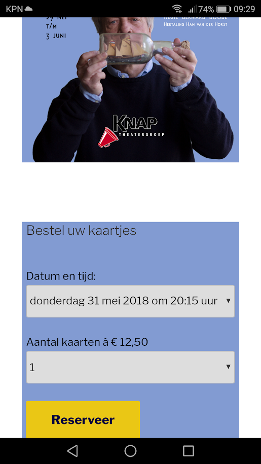

## Voor amateurtheater gezelschap Knap Schiedam

Zoals je op mijn website kunt lezen is een grote hobby van mij theater. Het volgende project is iets waar twee talenten van mij bij elkaar komen. Eén is acteren en twee programmeren, voor de voorstelling Koning Lier heb ik de online kaartverkoop in elkaar gezet en tegelijkertijd had ik een rol in de voorstelling. 

## De voorstelling

Koning Lier is gebaseerd op Shakespeares King Lear, een verhaal over een Britse koning die afstand doet van de troon en zijn land wil nalaten aan zijn drie dochters. Natuurlijk heeft deze Koning Lear een grote voorkeur voor zijn jongste allerliefste dochter, dit lijdt tot grote frustratie van de twee oudste dochters.

Het verhaal van King Lear is hertaalt door Han van der Horst tot Koning Lier. Hij heeft het verhaal volledig aangepast en verplaatst naar Schiedam, onder de naam van Liers scheepswerven en machine fabrieken. De beroemde scheepswerf van Frans van Lier, het verhaal speelt zich af in 1938. Vlak voor de tweede wereld oorlog, dat is ook aan alles te merken met opkomende verzet. Ook binnen de scheepswerf. 

## De kaartverkoop

Dit is een van die opdrachten die zomaar op mijn pad is komen vallen, ik zit in een gesprek met de regiseur en hij begint erover dat hij eigenlijk nog niemand heeft voor de kaartverkoop. Gezien mijn kennis en opleiding ben ik dan de geschikte persoon om dit te realiseren. Er bestond al een website [knapschiedam.nl/](http://www.knapschiedam.nl/), dit is een Wordpress website. Ik had zelf nog geen ervaring met Wordpress, maar ik had wel verhalen gehoord dat het niet erg ingewikkeld was. Dus dit was een mooie gelegenheid om me erin te verdiepen. Er was al een kaartverkoop systeem op de website aanwezig, een zelf gebouwde, maar toen ik de webpagina bekeek kreeg ik meteen een error melding te zien. Een kleine sneakpeek gedaan naar de al aanwezige code, maar het zag er naar uit dat die niet erg herbruikbaar was. Dus was de enige oplossing opnieuw te beginnen, op wat kleine herbruikbare componenten na. 

Er was al een PHP widget geïnstaleerd op de website, dus vandaar de keuze voor PHP. Wordpress is ook geschreven in PHP, dus dat maakt het makkelijk om samen te gebruiken. Het oude systeem werkte als volgt, er was eén pagina met een formulier waar de gebruiker zijn/haar naam achter kon laten en kon aangegeven hoeveel kaartjes hij/zij wou reserveren. Vervolgens werden er twee emails gestuurd eén naar de klant en eén naar de beheerder. De beheerder moest dus in zijn email box kijken voor de reserveringen en handmatig een kassa lijst samenstellen in Excel. 

Het systeem wat ik gebouwd heb werkt wat efficiënter en kan ook hergebruikt worden. Alle voorstellingen staan opgeslagen in een database, samen met de reserveringen en de klatgegevens. Zo kan iedereen die eerder een kaartje heeft gekocht op de hoogte worden gehouden van nieuwe voorstellingen. De kassa lijst kan simpelweg uit de database gehaald en hoeft niet meer handmatig gekopieerd te worden naar Excel. 

## Final word

Zoals voor elk systeem geldt, software is nooit klaar. Zo waren er ook na de voorstellingen nog een aantal features die toegevoegd moesten worden, om het makkelijker te maken. Dit gaat van van het verder normaliseren van de database tot aan een extra scherm om voorstellingen toe te voegen zodat dit niet meer handmatig hoeft met insert queries.

Dit was een leuk project om kennis te maken met Wordpress en het was ook nog eens mijn eerste project dat echt in productie is gegaan en echt is gebruikt, door de ruim 800 bezoekers van de voorstelling. Dus volgend jaar versie 2.0 van het kaartverkoop systeem!
