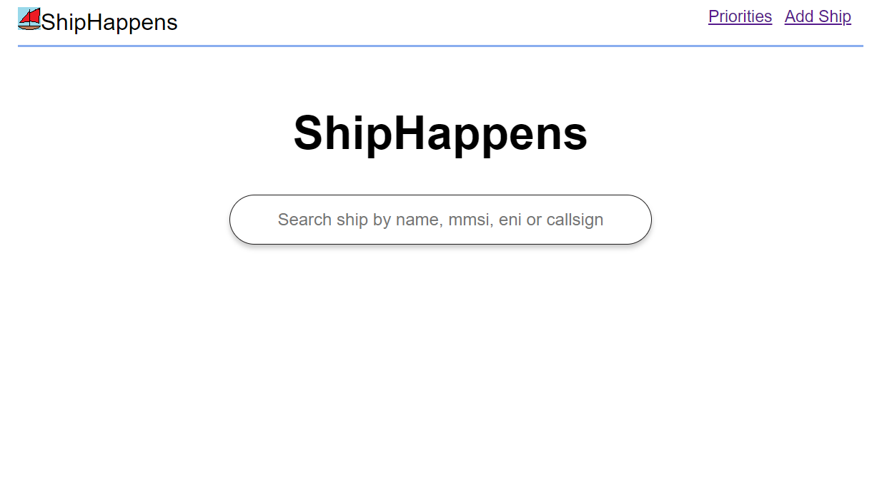
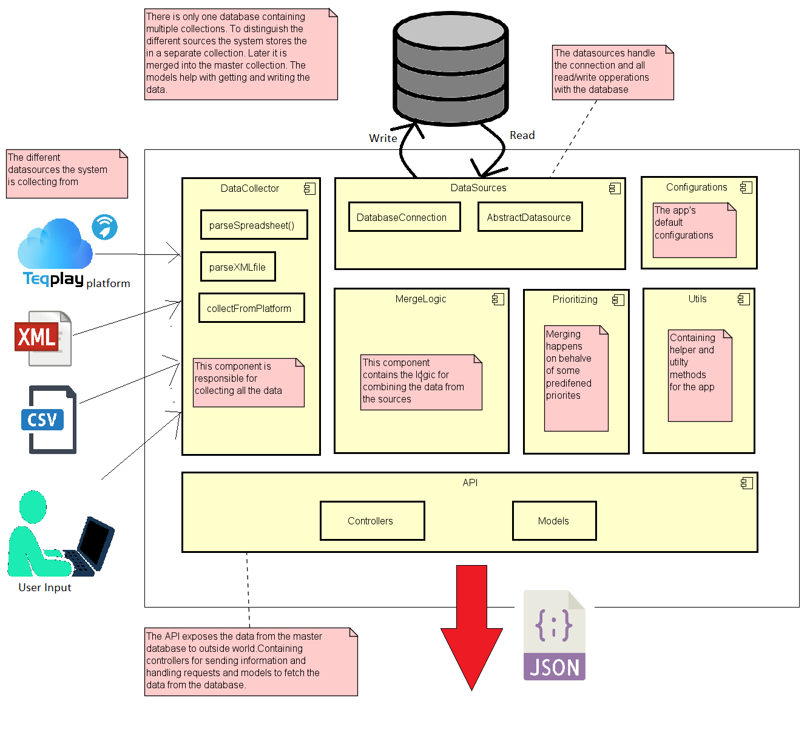
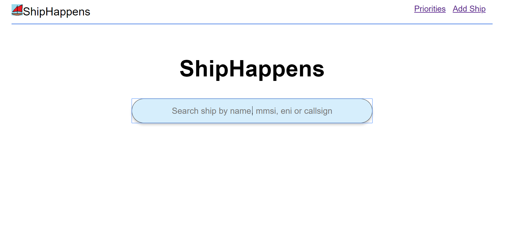
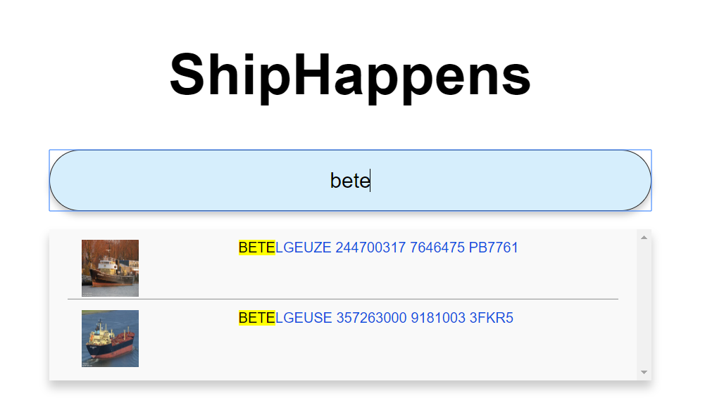
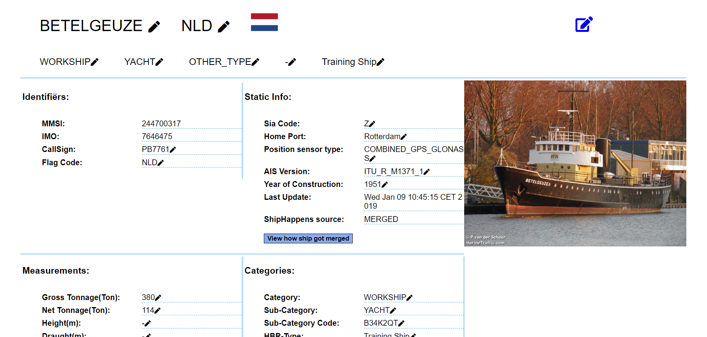
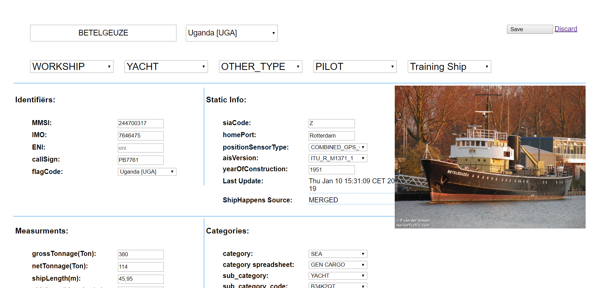
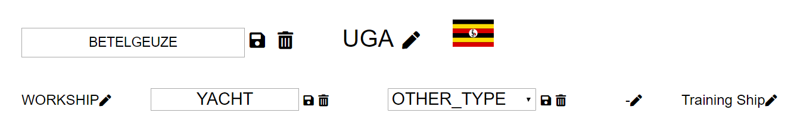
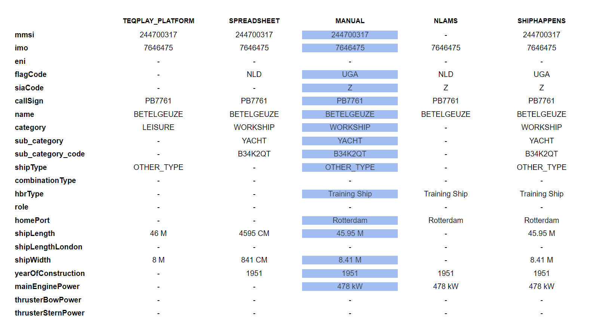
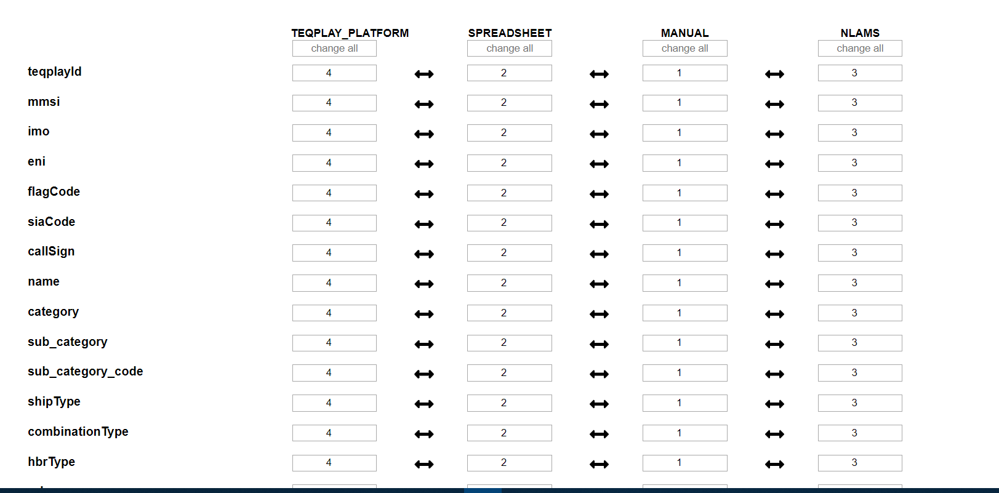
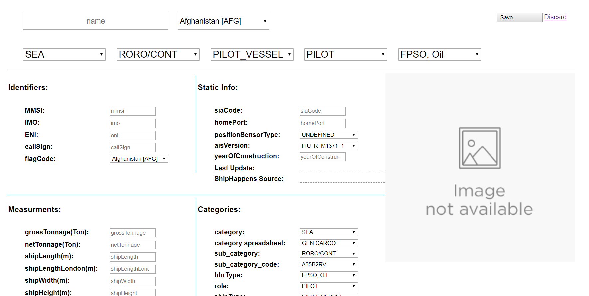

## Inleiding

Dit project heb ik gedaan voor mijn stage bij [TeqPlay](https://teqplay.nl/en/), TeqPlay is een bedrijf gevestigd in de [Van Nelle fabriek](https://www.google.com/maps/search/van%20nelle%20fabriek%20rotterdam). Het idee achter
dit project was om een master database to bouwen voor scheepsinformatie gecombineerd uit meerdere bronnen. Inclusief met een API die de *master data* weer beschikbaar maakt. 

## Het project ShipHappens

*Console info van de backend*

In de eerste week van mijn stage kreeg ik te horen wat de opdracht precies zou zijn, die het bedrijf voor ons bedacht had. Dat was dus het bouwen van éen master databron voor scheepsdata waar andere applicaties van TeqPlay in de toekomst hun informatie vandaan kunnen halen. Eerst wat achtergrond over hoe hoed it project to stand is gekomen. TeqPlay heeft een intern systeem dat continu informatie binnenhaalt en doorgeeft aan andere applicaties waaronder [RiverGuide](https://play.google.com/store/apps/details?id=nl.teqplay.riverguide). Die data komt uit verschillende bronnen, onder andere de [AIS](https://en.wikipedia.org/wiki/Automatic_identification_system) van schepen zend een hoop informatie uit, verder halen ze ook informatie uit hun eigen apps. Dit is user generated data, ingevoerd door de schipper. 

Het probleem is dat al deze data in verschillende tabellen en databases zit en ook uit verschillende bronnen komt. Het bedrijf zo het ideaal vinden als al deze gegevens dus gebundeld worden to éen centrale bron. 
Dit is dus wat ShipHappens moet gaan realiseren. 

## Eisen

Een aantal eisen die het project heeft zijn: 

1. De data moet om de n minuten binnengehaald kunnen worden. (Bijvoordbeeld elke dag of elk uur een update)
2. De applicatie slaat de bronnen waarvan de data vandaan komt apart op
3. De data uit de master database mag niet direct aangepast worden
5. Het proces van hoe de data samengevoegd wordt moet visueel inzichtelijk worden
6. Incorrecte data moet handmatig gewijzigd kunnen worden en vervolgens gemarkeerd worden als handmatig aangepast

## Google voor schepen
<iframe src="https://giphy.com/embed/9GJ2hd0GSmhgQ1YCYE" width="480" height="278" frameBorder="0" class="giphy-embed" allowFullScreen></iframe>

Net als Google verzameld ShipHappens een hoop informatie, in dit geval over schepen. Een ding wat ShipHappens gemeen heeft met Google is dat het systeem zuinig omgaat met welke data aan de gebruiker openbaar gemaakt wordt. Net als bij Google is het niet mogelijk voor de eindgebruiker om door een grote collectie met informatie te zoeken. De enige manier om interactie te hebben met de data is doormiddel van het zoekveld op de homepage. Zo krijgt de gebruiker alleen maar te zien waar hij/zij naar op zoek is. 

## De Master DataBase

*De Master Database*

Hierboven is een screenshot te zien van onze masterdatabase, deze tabel is een visuele representatie van de data. Als front-end framework is hiervoor [React](https://reactjs.org/) gebruikt, 
de tabel is gemaakt met [ReactTable](https://react-table.js.org/#/story/readme). De data komt uit een zelfgebouwde API die gemaakt is met behulp van [SpringBoot](http://spring.io/) in de programmeertaal [Kotlin](https://kotlinlang.org/). Onder de tabel is te zien waar de data vandaan komt en hoe die is samengesteld. Het idee van de masterdatabase is dus dat de data een samensmelting is van gegevens uit andere bronnen. Als de data maar uit 1 bron komt wordt dat aangegeven in de tabel, als de data samengevoegd is kan dat ook gezien worden en als de data
handmatig aangepast is dan moet dat ook zichtbaar zijn. 

Het handmatig aanpassen van de masterdatabase gaat als volgt: Er wordt een kopie gemaakt van de data in een andere tabel, vervolgens kan die tabel door een administrator worden aangepast en tenslotte wordt die nieuwe tabel samengevoegd met de data uit de masterdatabase. Het schip staat dan ook gemarkeerd als handmatig gewijzigd, op deze manier krijg je dus beter inzicht waar alle gegevens precies vandaan komen. 

*de beschikbare bronnen voor statische scheepsinformatie*

## Mergen van data

Het samenvoegen of mergen van data is waar onze applicatie om draait, we haleninformatie uit een bron en vervolgens doen we daar iets mee en daarna gaat de data weer naar buiten toe om gebruikt te worden andere applicaties. Het merge algoritme is de kern van het systeem, aan de hand van vooraf opgestelde prioriteiten wordt een beslissing genomen welke data voorang krijgt. Deze voorkeur is ook te wijzigen door de eindgebruiker. Het bedrijf wil dat de handmatige info of user created input voorrang krijgt op alle andere bronnen. 

Verder kan er dus voor elke aparte bron en elke aparte eigenschap bepaald worden wat de voorkeur heeft ten opzichte van een andere bron. 

Het samenvoegen van data wordt voornamelijk gedaan door een beslistabel, waar de prioriteiten staan aangegeven. Het attribuut van een bepaalde bron dat de hoogste prioriteit heeft gaat voor op alle andere bronnen. Als die afwezig is dan geld de daarop volgende hoogste prioriteit.

## Werking

In het bovenstaande diagram is de werking van het systeem uitgelegd. Het systeem bestaat uit een aantal componenten: Het verzamelen van data, het samenvoegen van data en het beschikbaar maken van dat. Het beschikbaar maken gebeurt door middel van de API. Verder is een aparte module voor het regelen van de connectie met de database. De master database bestaat uit meerdere collecties, elke databron wordt in een aparte collectie opgeslagen. Om vervolgens door de merge functie van het systeem in de master collectie te worden opgeslagen. Het samenvoegen gebeurd aan de hand van eerder bepaalde prioriteiten, de ene bron krijgt voorang op een andere bron. 

## Screenshots

De homepage

Zoekresultaten in een dropdown

Alle info over een schip op één pagina

Het is mogelijk om een schip te bewerken

Ook is het mogelijk om schepen te bewerken vanuit de detail pagina

Na het wijzigen is het visueel inzichtelijk hoe een schip samengesteld is

Dit gebeurd aan de hand van een aantal vooraf opgestelde merge criteria

De gebruiker kan ook schepen toevoegen aan de database, alle schepen zijn gemarkeerd als handmatig toegevoed

